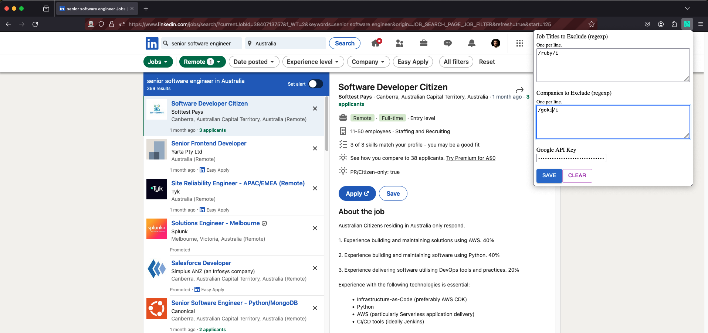

# linkedin-job-search-purifier

Firefox extension to enhance Linkedin's Job Search Results UX by purifying it with some AI power.



## Install It

Skip to the [getting started](#getting-started) section.

## Use Cases

**Filter Out Unwanted Companies**  
Linkedin allows you to filter by company, but it doesn't let you block companies. This extension allows you to filter out job search results by providing a regexp of companies to block. It is temporary and you can unblock companies at any time.

**Filter Out Unwanted Job Titles**  
You might also want to search for a particular role, such as `Software Engineer`, but you don't want to see results for `.NET Software Engineer`, because you do not program in `.NET`, but you do in many other languages. Same for when it returns `Full-stack` roles, but you're not interested in `Frontend` development. This extension let's you filter out job titles using regexp, which allows to remove those unwanted roles from your search results.

**Quickly identify PR/Citizen-only roles or if visa sponsorship is provided**  
Linkedin do not highlight whether roles require citizenship or permanent residency. That makes applicants that do not meet those pre-condition waste time reading the entire job posting, to only then realize they are not eligible to apply. This extension uses AI to read the job posting and let you know within seconds whether it requires PR/Citizenship or not.

### What's Next

I'm working on the following use cases (feel free to propose more):

**Ensure job posting match job search**  
This is particularly useful when searching for Full Time jobs, because some job posters advertise jobs as full time, whereas in reality, it's a contract with chances of becoming full time. Another example is when it's listed as fully remote, but in reality it's hybrid.

**Allow users to filter/highlight jobs by desired skills**  
Right now, Linkedin uses all skills defined in the profile to match with a job posting. For example, I used to work as a FE and I have Web-based skills listed on my profile; however, I'm not interested in FE development anymore, which makes Linkedin's skills match feature less useful than it could be, because I have to open the list of matches every single time to only then find out it matched with skills I don't care. This should improve that with a different approach where users define the set of skills they are interested in, and the extension gives a rating based on that instead.

## Development

### Design

The main approach taken is around how data is manipulated. Extensions of this kind usually interact directly with the DOM. Linkedin makes that a bit more challenging because it's UI is event-driven, and data is only injected in the DOM when needed. For that reason, I decided to intercept HTTP requests made to their backend and only interact with the DOM if strictly necessary:

- _Data Handling:_ requests are intercepted at the HTTP level. For job postings, it filters out entries based on user preference before the data is returned to the browser. For skills, it intercept and store them in local storage. Additional data not provided by Linkedin, such as visa or pr requirements are called `extras`. Once job posting and skills data becomes available, it makes calls to remote LLMs (Gemini, currently) to enrich the job posting with more information.
- _Storage:_ user preference is stored in local storage. Data about jobs (posting, skills, extras) are stored in session storage and destroyed on page refresh. While I could have leveraged caching and destroy only when necessary, finding out the "when" would introduce more complexity than needed at this stage, so I decided to be consistent with Linkedin and not cache at all.
- _Rendering:_ UI for the extension itself, such as options, is using react. When interacting with Linkedin's DOM, plain JS is used. Also, I try to use Linkedin's own UI elements where possible.
- _AI:_ used to save job seekers time in understanding requirements of job postings and also to enforce filters, such as remote and full time work setup.

#### What other alternatives are there

- [linkedin-jobs-api](https://github.com/VishwaGauravIn/linkedin-jobs-api): NodeJS package for getting job listings.
- [LinkedIn-Job-Selenium-Scrapper](https://github.com/hossam-elshabory/LinkedIn-Job-Selenium-Scrapper): Similar to the above, but in Python.
- [linkedin-jobs-notifier](https://github.com/hotsno/linkedin-jobs-notifier): Scraper with a Discord bot FE written in Python.
- [Linkedin-Job-Language-Filter](https://github.com/yavuzslmyldz/Linkedin-Job-Language-Filter): Filter jobs based on language.

### Getting Started

Follow this guide if you wish to contribute or simply install the extension.

#### 1. Install dependencies

```bash
yarn install
```

#### 2. Build the extension

This will run continuously and re-build the extension everytime you make a code change.  
Leave it running in a dedicated terminal process:

```bash
yarn dev:webpack
```

#### 3. Install it

This will pack the code from the previous step into an extension artefact, install it in a temporary browser session and launch it. Also leave it running in a dedicated terminal process:

```bash
# Change this according to your os/file system
# More info below:
# https://support.mozilla.org/en-US/kb/profile-manager-create-remove-switch-firefox-profiles
export FIREFOX_PROFILE="/Users/mariodes/Library/Application Support/Firefox/Profiles/development"
yarn dev:web-ext
```

#### 4. Set user preference

Click on the extension icon in the browser bar and make sure to fill:

- job titles and/or companies you want to filter out
- your Google API Token

#### 5. Start searching!

Now head over to [Linkedin Job Search](https://www.linkedin.com/jobs/search/?currentJobId=3903654341) and enjoy the improved experience!
